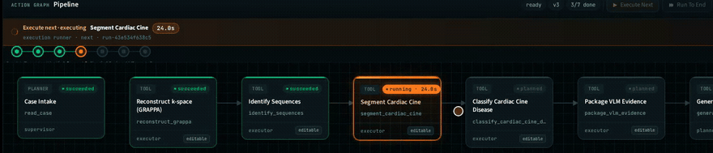
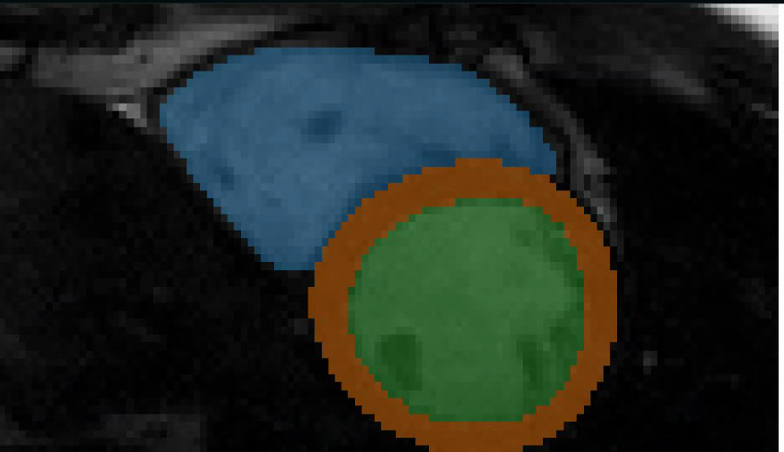

# MRI_Agent_v4 (Work in Progress)

**Note:** This is a work-in-progress (half-finished) open-source repository for the next iteration of the radiology MRI workstation agent. 

`MRI_Agent_v4` is the next product line for a natural-language radiology MRI
workstation.

It is the **UI / control-plane companion** to the open BCER engine repo
([`Albertlongzi/BCER`](https://github.com/Albertlongzi/BCER)). This repo owns the
chat interface, the action-graph planner, the web workstation UI, and the
execution control plane; BCER owns the actual MRI tool implementations. Nothing
here re-implements a tool — `packages/tools` bridges into the BCER tool registry
at the path given by `BCER_ROOT` (see below). Without a BCER checkout the tool
bridge reports `status: "down"` and no tool node can execute.

Throughout the docs, `v3` refers to that BCER engine.

It is intended to preserve the strongest architectural ideas from `v3`:

- Brain / Cerebellum separation
- structured planning
- deterministic execution
- reflection and recovery
- artifact provenance
- graph visibility

while replacing the benchmark-first, template-anchored planning style with a
more interactive workstation model:

- chat-first user interaction
- action-graph planning
- web-based DAG/workstation UI
- human-in-the-loop review and patching
- optional future supervisor-led specialist subagents

## Demo

A cardiac case run end to end from a typed clinical request: **raw multi-coil
k-space → GRAPPA reconstruction → identify → cine segmentation → disease
classification → evidence → report**. Every node is a real tool call dispatched
into the BCER engine. The amber node is executing, with its live elapsed time;
execution is asynchronous, so the graph stays interactive while a node runs.





That run measured **LV EDV 132.7 mL, ESV 42.4 mL, ejection fraction 68.0 %**
across 10 of 14 slices on a CMRxRecon short-axis acquisition, with every
geometry value taken from the vendor sidecar rather than assumed. After each
node the chat posts a summary built from that node's real outputs.

Read [Executor Coverage](#executor-coverage-read-this-before-judging-the-demo)
before drawing conclusions: real handlers exist for 8 of the 12 tools the
planner can compile, and the rest fail loudly rather than pretending to succeed.

## Status

This folder now contains:

- the initial planning/architecture pack
- a shared `ActionGraph` schema package
- a mock FastAPI backend
- a static workstation UI shell
- a first Brain client for OpenAI-compatible local model serving

The current implementation is a first scaffold, not the full product.

## Planned shape

```text
MRI_Agent_v4/
  apps/
    web/
    api/
    worker/      # planned only — not implemented, no code in this repo
  packages/
    schemas/
    planner/
    executor/
    tools/
  docs/
```

## Core documents

- `docs/V4_PRODUCT_SPEC.md`
- `docs/V4_ARCHITECTURE.md`
- `docs/V4_ACTION_GRAPH_SCHEMA.md`
- `docs/V4_IMPLEMENTATION_SEQUENCE.md`
- `docs/V4_TOOL_RUNTIME_STRATEGY.md`

Recommended reading order:

1. `docs/V4_PRODUCT_SPEC.md`
2. `docs/V4_ARCHITECTURE.md`
3. `docs/V4_ACTION_GRAPH_SCHEMA.md`
4. `docs/V4_IMPLEMENTATION_SEQUENCE.md`
5. `docs/V4_TOOL_RUNTIME_STRATEGY.md`

## Current Scaffold

Implemented today:

- `packages/schemas`
  - Pydantic models for `ActionGraph`, `ActionNode`, `ActionEdge`,
    `ArtifactRef`, `GraphEvent`, `ExecutionPatch`, and `CaseState`
- `packages/executor`
  - deterministic runtime/store with patch application, execute-next, reset,
    and real artifact writing under `artifacts/`
- `packages/tools`
  - read-only bridge into the `v3` (BCER) registry for tool metadata, domain
    catalog, capability summary, and bridge health, plus runtime-profile config
    loading and a first dispatcher for `inproc` and `subprocess` launches
- `apps/api`
  - backend endpoints for session, graph, events, chat, patch preview,
    proposal application, execution, reset, tool discovery, planner health,
    and artifact serving
- `packages/planner`
  - OpenAI-compatible Brain client and prompt/service layer for local `vLLM`
    or other `/v1/chat/completions` backends
- `apps/web`
  - static workstation UI with `chat + graph + artifact viewer + inspector`
- `run_demo.py`
  - local entrypoint for the demo server

## Executor Coverage (read this before judging the demo)

The planner and compiler can emit graphs for **12** tools. The executor has real
handlers for **8** of them:

| Tool | Executor handler |
| --- | --- |
| `identify_sequences` | yes — real BCER call |
| `reconstruct_grappa` | yes — real BCER call |
| `register_to_reference` | yes — real BCER call |
| `segment_prostate` | yes — real BCER call |
| `segment_cardiac_cine` | yes — real BCER call |
| `classify_cardiac_cine_disease` | yes — real BCER call |
| `package_vlm_evidence` | yes — real BCER call |
| `generate_report` | yes — real BCER call, `llm_mode=disabled` |
| `brats_mri_segmentation` | **no** |
| `classify_brain_glioma_grade` | **no** |
| `detect_lesion_candidates` | **no** |
| `extract_roi_features` | **no** |

Consequences, stated plainly:

- **Cardiac and prostate run end to end.** Cardiac additionally runs from raw
  multi-coil k-space, since `reconstruct_grappa` leads the chain when the case
  input is HDF5.
- **Brain graphs do not run.** `brats_mri_segmentation` and
  `classify_brain_glioma_grade` have no handler, so the planner compiles a brain
  graph and the executor then raises `MissingExecutorHandlerError` on the first
  unimplemented node. That is deliberate: there is no mock mode and no
  placeholder result, so a tool that cannot really run fails loudly instead of
  reporting fabricated success. The same applies to the prostate lesion and
  radiomics steps.
- Any of this requires a working `BCER_ROOT` plus case data; the engine repo
  ships the demo cases and the asset download script.
- `generate_report` runs with `llm_mode=disabled`, i.e. deterministic templating,
  not model-written prose. Its report template is still prostate-shaped: a
  cardiac `report.json` carries unused PI-RADS-style fields even though the
  measurements in it are correct.

## Run The Demo

```bash
git clone https://github.com/Albertlongzi/MRI_Agent_v4.git
cd MRI_Agent_v4
python -m venv .venv
.venv/bin/pip install -r requirements.txt
.venv/bin/python run_demo.py
```

Then open:

```text
http://127.0.0.1:8008
```

## Tool Bridge Engine Repo (`BCER_ROOT`)

The tool bridge in `packages/tools` loads the real tool registry from the open
BCER engine repo (`BCER_open`). Point `BCER_ROOT` at your checkout:

```bash
export BCER_ROOT=/path/to/BCER_open
```

See `.env.example` for the full list. Notes:

- `BCER_ROOT` may be the repo root itself (`/path/to/BCER_open`) or a parent
  directory that contains `BCER_open/`.
- The bridge places that directory **itself** on `sys.path`, because `BCER_open`
  uses top-level absolute imports (`from commands.registry import ToolRegistry`)
  and the bridge imports `mri_agent_shell.tool_registry`.
- If `BCER_ROOT` is set but does not resolve to a real checkout, the bridge
  reports `status: "down"` rather than silently falling back to another repo.
- If it is unset, the bridge auto-discovers a sibling `BCER_open/` checkout next
  to this repo.
- Legacy aliases `MRI_AGENT_V3_ROOT` and `MRI_AGENT_ROOT` are still honoured.
- The resolved root is prepended to `sys.path`, so it wins over any stale
  `pip install -e` of an older engine checkout recorded in
  `site-packages/easy-install.pth`. If your interpreter has such an entry,
  removing it is still recommended.

Verify the bridge:

```bash
BCER_ROOT=/path/to/BCER_open .venv/bin/python -c \
  "from packages.tools.bridge import bridge_health; print(bridge_health())"
```

A healthy bridge reports `status: "ok"` with 20 tools and 3 domains.

Available API routes:

- `GET /api/health`
- `GET /api/session`
- `GET /api/graph`
- `GET /api/events`
- `GET /api/tools/bridge/health`
- `GET /api/tools`
- `GET /api/domains`
- `GET /api/capabilities`
- `GET /api/planner/health`
- `GET /api/runtime/profiles`
- `GET /api/runtime/tools/{tool_name}`
- `POST /api/chat`
- `POST /api/patch`
- `POST /api/proposals/apply-latest`
- `POST /api/execute/next`
- `POST /api/execute/until-done`
- `POST /api/reset`

Artifact files are served under:

- `GET /artifacts/...`

## Current Behavior

The scaffold now supports:

- previewing a patch that inserts a human review checkpoint
- applying the latest proposal into the canonical ActionGraph
- executing the next runnable node deterministically
- running the five implemented prostate tools as real `v3` (BCER) calls —
  `identify_sequences`, `register_to_reference`, `segment_prostate`,
  `package_vlm_evidence`, and `generate_report` (`llm_mode=disabled`)
- failing loudly on the six tools that have no executor handler, rather than
  returning a placeholder success (see *Executor Coverage* above)
- writing real JSON / TXT / SVG artifacts for the prostate demo workflow
- exposing the `v3` tool catalog, domains, and capabilities through a safe
  read-only bridge
- exposing runtime-profile metadata so tools can be mapped to `control-plane`,
  `qwen_vllm`, `nnunet-gpu`, or `apptainer` execution classes
- dispatching `run_v3_tool(...)` through a runtime-profile-aware launcher
  instead of hard-coding in-process execution for every tool
- attempting real Brain replies through an OpenAI-compatible local LLM endpoint
  before falling back to the deterministic mock chat behavior
- previewing generated `json`, `txt`, and `svg` artifacts in the workstation UI
- resetting the demo session and clearing the artifact tree through the store

## Design principle

`v4` should feel like a radiology workstation with a visible graph, not a
benchmark harness with a hidden planner.

## Brain LLM Defaults

The Brain service defaults to a local OpenAI-compatible endpoint:

```bash
export MRI_AGENT_V4_LLM_BASE_URL=http://127.0.0.1:8000/v1
export MRI_AGENT_V4_LLM_MODEL=Qwen/Qwen3-VL-30B-A3B-Thinking
```

Optional knobs:

```bash
export MRI_AGENT_V4_LLM_API_KEY=EMPTY
export MRI_AGENT_V4_LLM_TIMEOUT_S=20
export MRI_AGENT_V4_LLM_ENABLED=1
```
